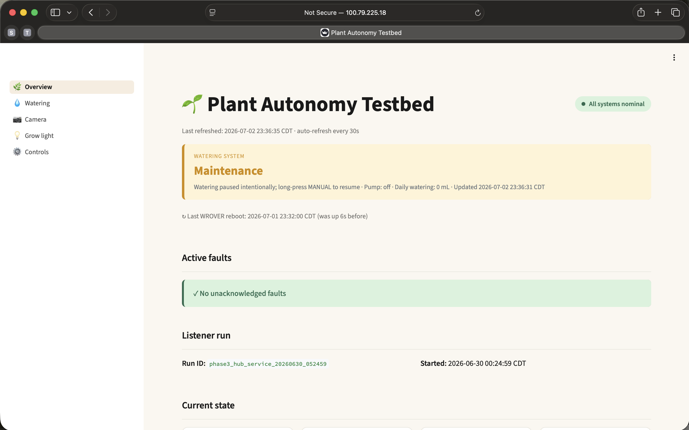
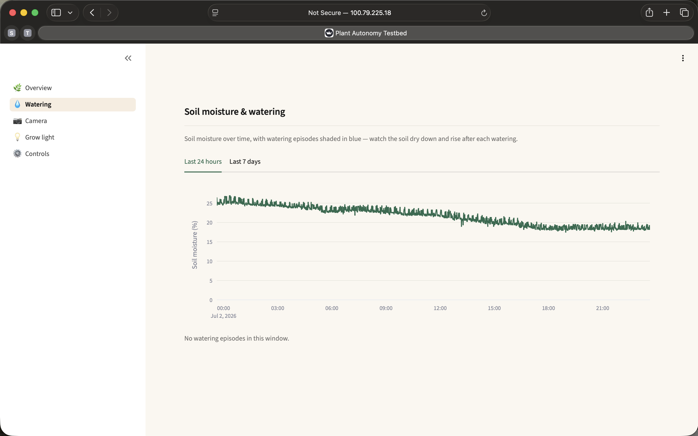
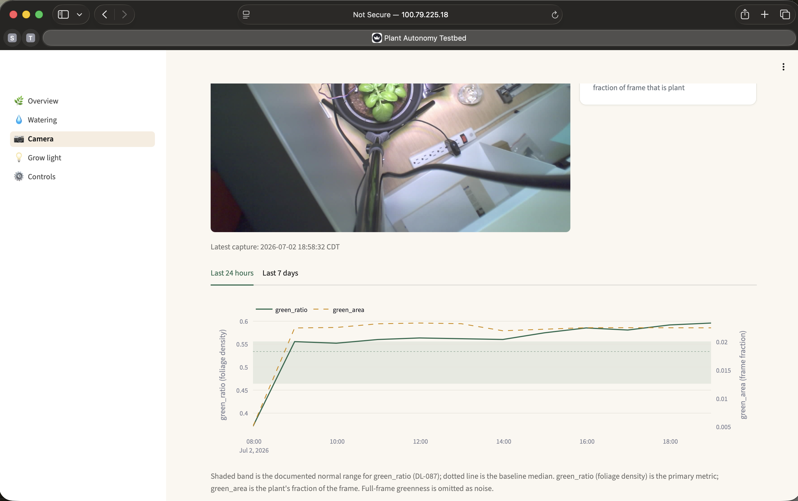
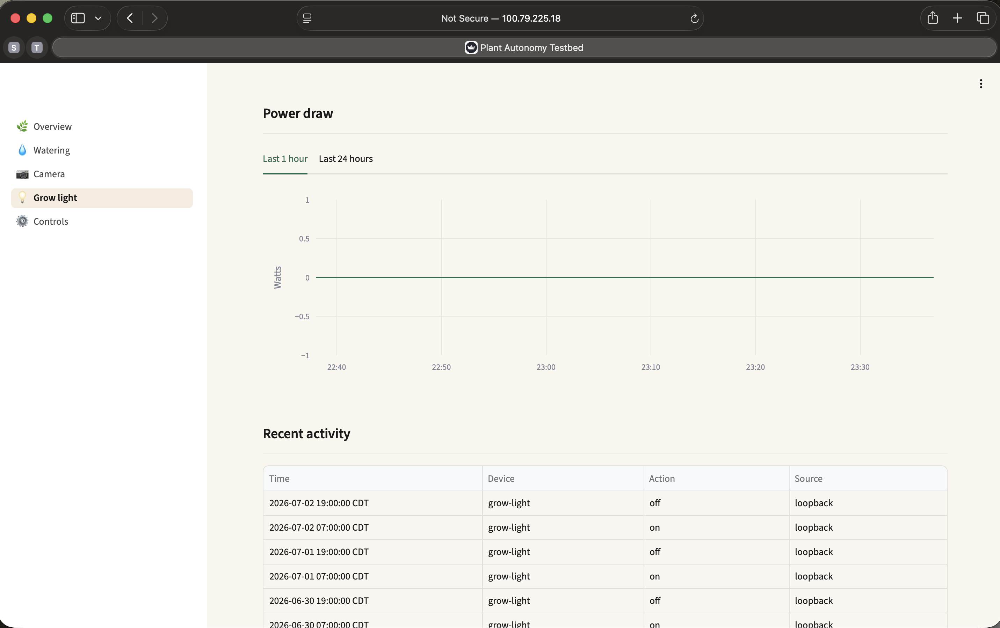

# 06 — Streamlit dashboard

A live Streamlit dashboard on the Pi that reads the SQLite database populated by
the listener (`hub/04-listener/`). It is read-only over the data — its one control
(the maintenance toggle) acts solely by publishing an MQTT command and never writes
the database. It is a **multipage app**: a lean Overview plus Watering, Camera,
Grow light, and Controls pages, so each page runs only its own queries per refresh
(the fix for the single-page version being heavy on mobile). Cream botanical theme,
green primary, semantic status colors, 30 s auto-refresh.

See [DL-037](../../docs/decision-log.md) for the original design (theme, and storing
UTC in the database while displaying America/Chicago in the UI), [DL-095](../../docs/decision-log.md)
for the multipage restructure, and [DL-090](../../docs/decision-log.md)/[DL-094](../../docs/decision-log.md)
for the camera panel and the maintenance control.

## Files

```text
hub/06-dashboard/
  dashboard.py            router: page config, theme, 30s refresh, st.navigation
  dash_common.py          shared constants + DB / query / render helpers
  dash_pages/
    overview.py           status, faults, reboot review, listener run, current state, latest image, environment
    watering.py           soil-moisture trend + watering episodes (24h / 7d)
    camera.py             latest capture + green_ratio / green_area trend (24h / 7d)
    growlight.py          grow-light power draw (1h / 24h) + recent on/off activity
    controls.py           maintenance toggle (publishes plant/cmd/maintenance)
  .streamlit/config.toml  Streamlit theme + headless server settings
  README.md               this file
```

## Pages

- **Overview** — the vital glance: status banner (including the intentional
  `maintenance` and fault states), active faults, the ESP32 reboot review,
  listener-run identity, current-state cards (grow light, power, voltage, Shelly),
  the latest camera image, and live plant-environment cards.
- **Watering** — soil moisture over time with watering episodes shaded (24h / 7d).
- **Camera** — the latest capture plus the `green_ratio` / `green_area` trend with
  the DL-087 baseline band (24h / 7d).
- **Grow light** — grow-light power draw (1h / 24h) and the recent on/off events.
- **Controls** — the maintenance pause/resume toggle; hidden during fault states.

## Visual references (desktop)

- 
- 
- 
- 

## Setup procedure on the Pi

### 1. Install dependencies in the existing venv

```text
cd ~/plant-hub
source venv/bin/activate
pip install streamlit pandas plotly streamlit-autorefresh pillow paho-mqtt
```

`pillow` powers the cached camera-image downscaler; `paho-mqtt` publishes the
maintenance command. The maintenance control also needs `MQTT_USER` / `MQTT_PASS`,
supplied to the service via its `EnvironmentFile` (see `hub/07-dashboard-service/`).

### 2. Install the theme config

```text
mkdir -p ~/plant-hub/.streamlit
# Copy .streamlit/config.toml from this repo to ~/plant-hub/.streamlit/
```

### 3. Copy the app tree

Copy `dashboard.py`, `dash_common.py`, and the whole `dash_pages/` folder from this
repo to `~/plant-hub/`. The service runs `dashboard.py`; the pages are resolved
relative to it.

### 4. Run it manually

```text
cd ~/plant-hub
source venv/bin/activate
streamlit run dashboard.py --server.address 0.0.0.0 --server.port 8501
```

The `--server.address 0.0.0.0` flag binds to all interfaces so the dashboard is
reachable from other devices on the LAN and over Tailscale. Default is localhost-only.

### 5. Access the dashboard

**Recommended — Tailscale tailnet IP (works from anywhere with Tailscale running):**

```text
http://100.79.225.18:8501
```

This URL is the canonical access point — it works from the developer Mac, the
developer iPhone, or any device on the tailnet, regardless of the physical network.

**Fallback — LAN IP (only on the local network):**

```text
http://10.6.19.139:8501
```

See [DL-038](../../docs/decision-log.md) for the LAN/tailnet rationale and why the
tailnet IP is canonical.
