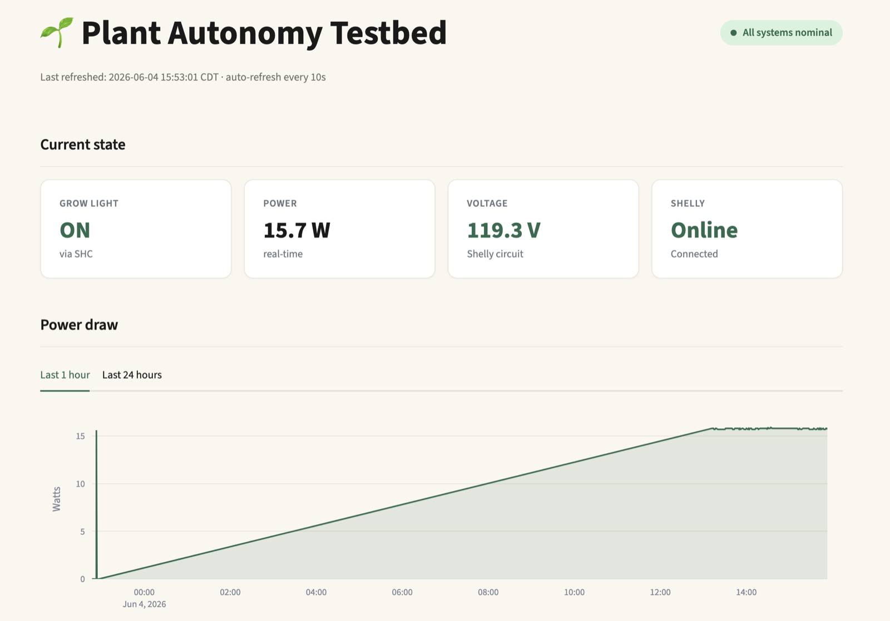
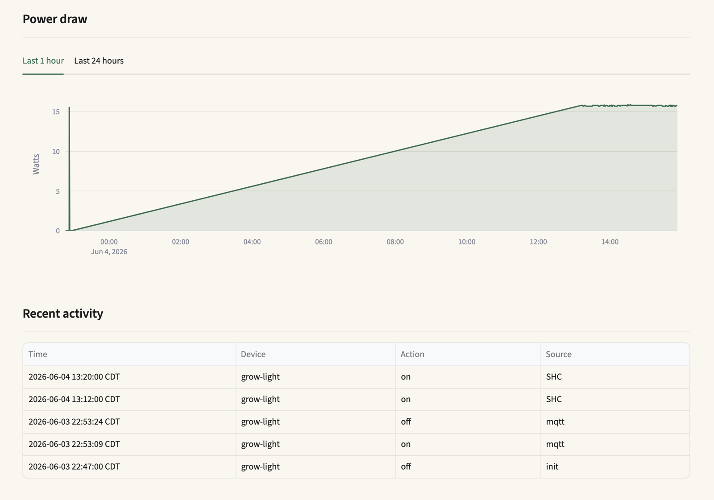
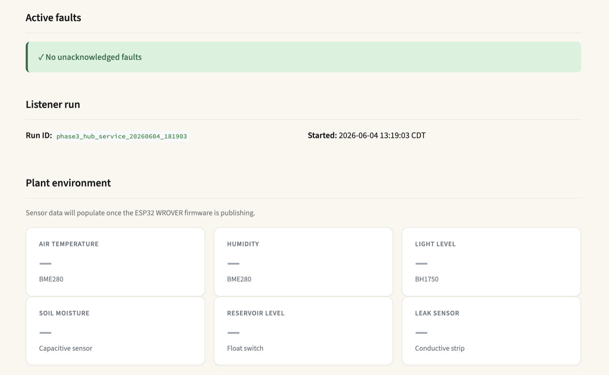
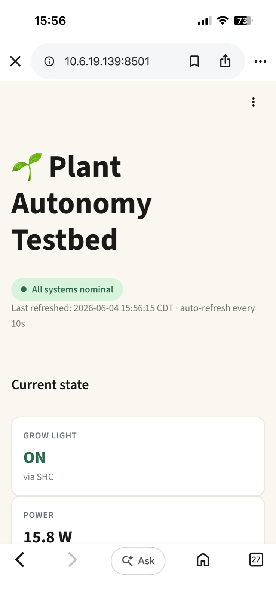
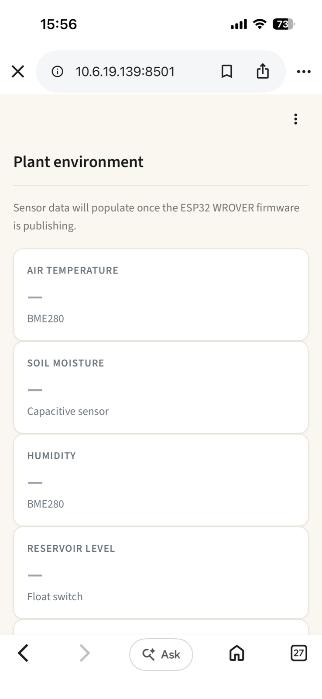

# 06 — Streamlit dashboard

Read-only web dashboard reading from the SQLite database populated by the
listener service (`hub/04-listener/`). Cream botanical theme with green primary
and semantic status colors. Mobile-friendly layout.

See [DL-037](../../docs/decision-log.md) for design rationale and the rationale
behind storing UTC in the database and displaying America/Chicago in the UI.

## Files

| File | Purpose |
|---|---|
| `dashboard.py` | Streamlit app; reads from `plant.db`, renders the dashboard |
| `.streamlit/config.toml` | Streamlit theme (light cream + green primary) |
| `README.md` | This file |

## What's shown

- **Header**: project title + overall health pill (green / amber / red)
- **Current state**: grow light state, real-time power, voltage, Shelly online status
- **Power draw**: interactive Plotly chart with 1-hour and 24-hour tabs
- **Recent activity**: last 10 actuator events
- **Active faults**: list of unacknowledged faults (banner shows clean status when none)
- **Listener run**: current run identifier and start time
- **Plant environment placeholders**: empty cards for the upcoming WROVER sensor data

## Visual references

Desktop view:
- 
- 
- 

Mobile view (iPhone Safari):
- 
- 

## Setup procedure on the Pi

### 1. Install dependencies in the existing venv

```text
cd ~/plant-hub
source venv/bin/activate
pip install streamlit pandas streamlit-autorefresh plotly
```

### 2. Install the theme config

```text
mkdir -p ~/plant-hub/.streamlit
# Copy .streamlit/config.toml from this repo to ~/plant-hub/.streamlit/
```

### 3. Copy `dashboard.py` from this repo to `~/plant-hub/`

### 4. Run it manually

```text
cd ~/plant-hub
source venv/bin/activate
streamlit run dashboard.py --server.address 0.0.0.0 --server.port 8501
```

The `--server.address 0.0.0.0` flag binds to all interfaces so the dashboard
is reachable from other devices on the same LAN. Default is localhost-only.

### 5. Access the dashboard

The dashboard binds to all interfaces (`0.0.0.0`) and is reachable via two addresses:

**Recommended — Tailscale tailnet IP (works from anywhere with Tailscale running):**

```text
http://100.79.225.18:8501
```

This URL is the canonical access point. It works from the developer Mac, the developer iPhone, or any future device on the same tailnet, regardless of which physical network the device is on (JSU_DEVICE, cellular, home WiFi, hotel WiFi).

**Fallback — LAN IP (only works on JSU_DEVICE):**

```text
http://10.6.19.139:8501
```

Useful when Tailscale isn't available or for a fresh device that hasn't been added to the tailnet yet. May behave inconsistently on machines that also have Tailscale installed; the tailnet IP is more reliable in that case.

See [DL-038](../../docs/decision-log.md) for the rationale on the LAN/tailnet distinction and why the tailnet IP is canonical.